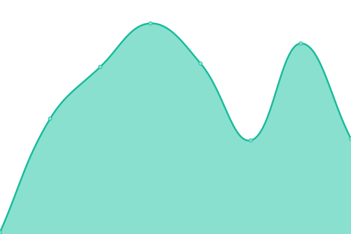
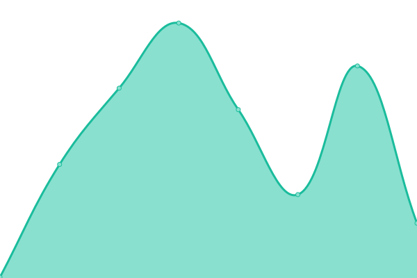
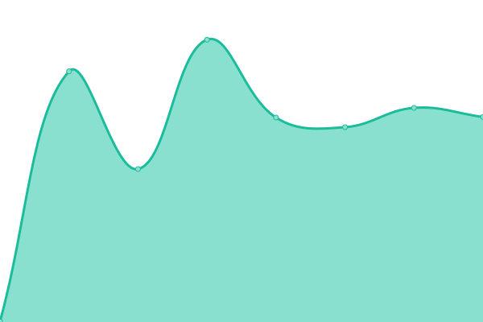

# [📈 Live Status](https://demo.upptime.js.org): <!--live status--> **🟩 All systems operational**

This repository contains the open-source uptime monitor and status page for [Upptime](https://upptime.js.org), powered by [Upptime](https://github.com/upptime/upptime).

With [Upptime](https://upptime.js.org), you can get your own unlimited and free uptime monitor and status page, powered entirely by a GitHub repository. We use [Issues](https://github.com/upptime/upptime/issues) as incident reports, [Actions](https://github.com/eightfold-technology/upptime/actions) as uptime monitors, and [Pages](https://demo.upptime.js.org) for the status page.

<!--start: status pages-->
<!-- This summary is generated by Upptime (https://github.com/upptime/upptime) -->
<!-- Do not edit this manually, your changes will be overwritten -->
<!-- prettier-ignore -->
| URL | Status | History | Response Time | Uptime |
| --- | ------ | ------- | ------------- | ------ |
|  [Google](https://www.google.com) | 🟩 Up | [google.yml](https://github.com/eightfold-technology/upptime/commits/HEAD/history/google.yml) | 

 72ms
     
 | 

<a href="https://upptime.eightfold.cloud/history/google">100.00%</a>
    

|  [Wikipedia](https://en.wikipedia.org) | 🟩 Up | [wikipedia.yml](https://github.com/eightfold-technology/upptime/commits/HEAD/history/wikipedia.yml) | 

 136ms
     
 | 

<a href="https://upptime.eightfold.cloud/history/wikipedia">100.00%</a>
    

|  [Hacker News](https://news.ycombinator.com) | 🟩 Up | [hacker-news.yml](https://github.com/eightfold-technology/upptime/commits/HEAD/history/hacker-news.yml) | 

 366ms
     
 | 

<a href="https://upptime.eightfold.cloud/history/hacker-news">100.00%</a>
    

|  [Eightfold Technology](https://eightfold.io) | 🟩 Up | [eightfold-technology.yml](https://github.com/eightfold-technology/upptime/commits/HEAD/history/eightfold-technology.yml) | 

 161ms
     
 | 

<a href="https://upptime.eightfold.cloud/history/eightfold-technology">100.00%</a>
    

|  [Eightfold Cloud](https://eightfold.cloud) | 🟩 Up | [eightfold-cloud.yml](https://github.com/eightfold-technology/upptime/commits/HEAD/history/eightfold-cloud.yml) | 

 215ms
     
 | 

<a href="https://upptime.eightfold.cloud/history/eightfold-cloud">100.00%</a>
    

|  [Nexsora Strapi](https://nexsora.eightfold.cloud) | 🟩 Up | [nexsora-strapi.yml](https://github.com/eightfold-technology/upptime/commits/HEAD/history/nexsora-strapi.yml) | 

 234ms
     
 | 

<a href="https://upptime.eightfold.cloud/history/nexsora-strapi">100.00%</a>
    

|  [Raptect Strapi](https://raptect.eightfold.cloud) | 🟩 Up | [raptect-strapi.yml](https://github.com/eightfold-technology/upptime/commits/HEAD/history/raptect-strapi.yml) | 

 225ms
     
 | 

<a href="https://upptime.eightfold.cloud/history/raptect-strapi">100.00%</a>
    

|  [Nexprotek Strapi](https://nexprotek.eightfold.cloud) | 🟩 Up | [nexprotek-strapi.yml](https://github.com/eightfold-technology/upptime/commits/HEAD/history/nexprotek-strapi.yml) | 

 235ms
     
 | 

<a href="https://upptime.eightfold.cloud/history/nexprotek-strapi">100.00%</a>
    

|  [Linceo Today](https://linceo.today) | 🟩 Up | [linceo-today.yml](https://github.com/eightfold-technology/upptime/commits/HEAD/history/linceo-today.yml) | 

 402ms
     
 | 

<a href="https://upptime.eightfold.cloud/history/linceo-today">100.00%</a>
    

|  [Linceo Today Strapi](https://admin.linceo.today) | 🟩 Up | [linceo-today-strapi.yml](https://github.com/eightfold-technology/upptime/commits/HEAD/history/linceo-today-strapi.yml) | 

 246ms
     
 | 

<a href="https://upptime.eightfold.cloud/history/linceo-today-strapi">100.00%</a>
    

<!--end: status pages-->

[**Visit our status website →**](https://demo.upptime.js.org)

## 📄 License

- Powered by: [Upptime](https://github.com/upptime/upptime)
- Code: [MIT](./LICENSE) © [Upptime](https://upptime.js.org)
- Data in the `./history` directory: [Open Database License](https://opendatacommons.org/licenses/odbl/1-0/)
